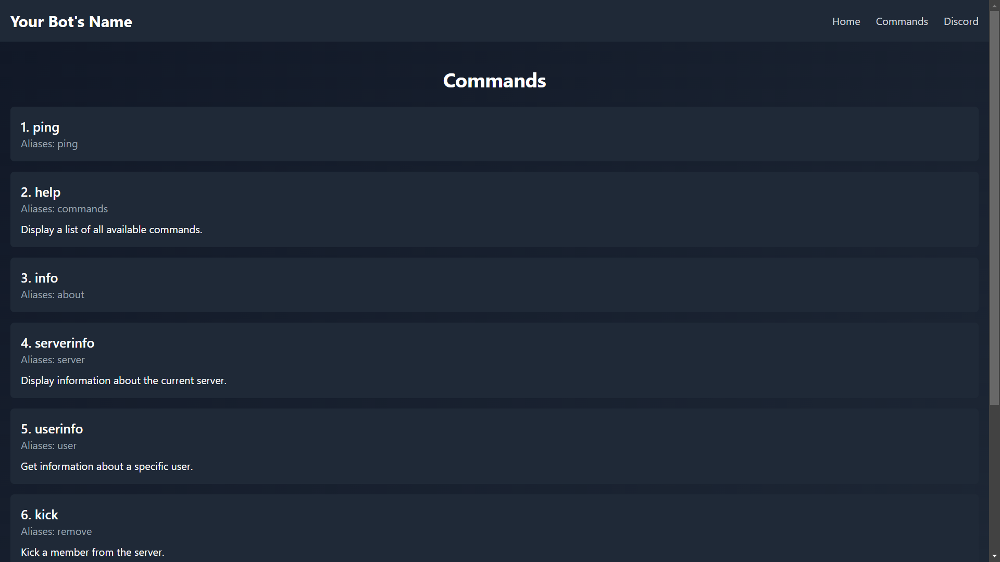
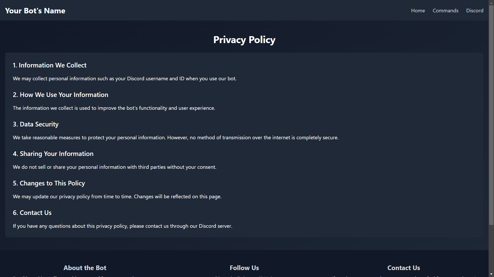
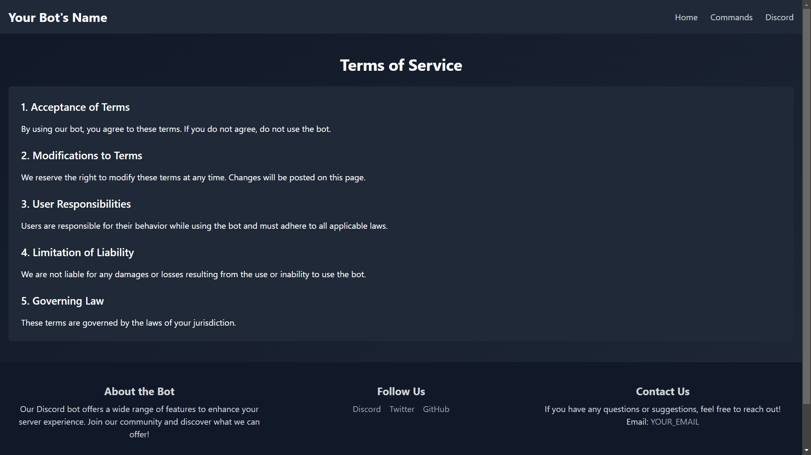

# Discord Bot Website

This project is designed to create a website for a Discord bot. Users can access the bot's commands and get information about the bot.

## Features

- **User-Friendly Interface:** A modern and responsive design.
- **Commands:** Users can access all commands of the bot.
- **Mobile-Friendly:** Optimized for mobile devices.
- **Standard Footer and Header:** Contains standard footer and header on all pages.
- **Quick Access:** Command descriptions can be viewed with a single click.

## Installation

1. **Clone the Repository:**

   ```bash
   git clone https://github.com/Rynix01/Discord-Bot-Website.git
   cd Discord-Bot-Website
   ```

2. **Install Dependencies:**

   ```bash
   npm install
   ```

3. **Run the Application:**

   ```bash
   npm start
   ```

4. **Open in Browser:**

   Access your website by navigating to `http://localhost:3000` in your browser.

## Usage

- **Home Page:** Contains brief information about the bot.
- **Commands:** Users can view all commands and their descriptions.
- **Terms of Service:** A page outlining the usage terms.
- **Privacy Policy:** Information on how user data is protected.

## Contributors

- [Murat Bulut (Rynix)](https://github.com/Rynix01)

## License

This project is licensed under the MIT License. For more details, refer to the `LICENSE` file.

## Preview Images

Here are some preview images of the project:

| Home Page                                   | Home Page Continued                                   | Command Page                                      | Privacy Policy                                    | Terms of Service                                  |
| ------------------------------------------- | ----------------------------------------------------- | ------------------------------------------------- | ------------------------------------------------- | ------------------------------------------------- |
|  |  |  |  |  |

### Explanation

- The images are referenced with their filenames. Make sure the paths are correct according to your project structure.
- Adjust the image names and paths if needed based on the actual file structure. If the images are in a different folder, modify the paths accordingly.
- This format creates a table layout for a clean presentation of the images.

Feel free to customize the descriptions or layout to fit your needs!
